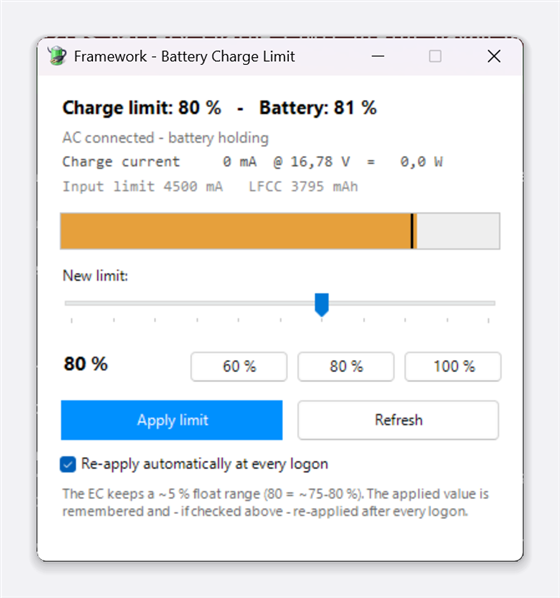

# Framework Battery Limit

A small Windows GUI for setting the battery charge limit on Framework laptops — without clicking through a UAC dialog every time, and without losing the value on the next reboot.



## Why

Windows has no built-in charge limit setting; on every vendor it lives in firmware. Framework offers two ways in:

- **BIOS** (`F2` → Advanced → Battery Charge Limit): permanent, but every change costs a reboot.
- **[`framework_tool`](https://github.com/FrameworkComputer/framework-system)**: sets the value in the embedded controller at runtime — but it's a CLI, it needs admin rights, and the value does not survive a reboot.

This project turns the second option into something you'd actually use day to day: a GUI with a slider, plus a scheduled task that restores your last setting after every logon. You get the convenience of the CLI *and* the persistence of the BIOS route.

## What the GUI shows

- current charge limit and battery level, as a bar with a limit marker (orange = above the limit, discharging toward it)
- **charge current, charge voltage and the resulting wattage** — refreshed every 3 seconds, so you can watch the current ramp up and down live
- the charger's input current limit and LFCC (Last Full Charge Capacity — your battery health indicator over time)
- slider from 50–100 % plus 60/80/100 presets
- a checkbox to enable or disable the autostart task without opening Task Scheduler

## Installation

Requirements: a Framework laptop, Windows, PowerShell 5.1 or newer.

```powershell
git clone https://github.com/Strilled/framework-battery-limit.git
cd framework-battery-limit
# from an elevated PowerShell:
.\install.ps1
```

The script creates the target directory, downloads `framework_tool.exe` from its GitHub release, registers the tasks and creates the shortcuts.

| Parameter | Default | Purpose |
|---|---|---|
| `-InstallDir` | `%ProgramFiles%\FrameworkBatteryLimit` | target directory |
| `-Limit` | `80` | initial limit in percent (ignored if `limit.txt` already exists) |
| `-ToolVersion` | `v0.6.5` | release tag of `framework-system` |
| `-SkipDownload` | – | don't download `framework_tool.exe` |

Uninstall:

```powershell
.\uninstall.ps1 -ResetLimit
```

## How it works

```
Desktop shortcut
   └─ wscript fw-battery.vbs           ← not elevated, no UAC
        └─ schtasks /run FrameworkBatteryLimit-GUI
             └─ task (RunLevel Highest)
                  └─ fw-gui-run.vbs → powershell fw-battery.ps1   ← the GUI
                       ├─ framework_tool.exe --charge-limit <n>
                       └─ writes <n> to limit.txt

Logon (+15 s)
   └─ task FrameworkBatteryLimit-Apply (RunLevel Highest, hidden)
        └─ fw-apply.vbs → powershell fw-apply.ps1
             └─ reads limit.txt, applies it, logs to fw-apply.log
```

Routing through a scheduled task is the trick that avoids the UAC dialog: the task runs with highest privileges, and *triggering* a task does not itself require elevation.

The `.vbs` wrappers exist for exactly one reason — `wscript` starts PowerShell with window style 0, so no console window flashes up.

| File | Role |
|---|---|
| `src/fw-battery.ps1` | the GUI (WinForms) |
| `src/fw-apply.ps1` | headless: reads `limit.txt`, applies the value, writes the log |
| `src/fw-battery.vbs` | shortcut target, triggers the GUI task |
| `src/fw-gui-run.vbs` | action of the GUI task |
| `src/fw-apply.vbs` | action of the apply task |
| `install.ps1` / `uninstall.ps1` | setup and removal |

At runtime the install directory also gains `framework_tool.exe`, `limit.txt` (the remembered value) and `fw-apply.log`.

## Third-party component: `framework_tool`

All the actual hardware work is done by **`framework_tool`**, Framework's own utility. This project is only a wrapper around it — it does not talk to the embedded controller itself.

| | |
|---|---|
| Upstream | <https://github.com/FrameworkComputer/framework-system> |
| Vendor | Framework Computer Inc. |
| License | BSD-3-Clause ([LICENSE.md](https://github.com/FrameworkComputer/framework-system/blob/main/LICENSE.md)) |
| Pinned version | `v0.6.5` (override with `-ToolVersion`) |
| Download URL | `https://github.com/FrameworkComputer/framework-system/releases/download/<tag>/framework_tool.exe` |
| Commands used | `--charge-limit [<n>]`, `--power` |

The binary is **not** vendored in this repository. `install.ps1` fetches it from the official GitHub release at install time and runs `Unblock-File` on it; `.gitignore` keeps it out of version control. If you'd rather supply it yourself, drop it into the install directory and pass `-SkipDownload`.

Credit for the hard part — talking to the EC, decoding the charger registers, supporting the whole Framework lineup — belongs to Framework and the `framework-system` contributors.

## Security note

A task running with highest privileges that launches a script from a writable directory is a privilege escalation path: whoever can replace the script file gets admin rights on your next click. Therefore:

- the default install directory is `%ProgramFiles%`, where the standard ACL already covers this;
- for a custom path outside protected directories, `install.ps1` hardens the ACL itself: inheritance off, write access only for SYSTEM and Administrators, owner set to Administrators.

One deliberate trade-off remains: any local process can trigger the GUI task. All it can do is open the GUI — it cannot change the limit without interaction — which for a charge-limit utility seems acceptable. If you disagree, skip the tasks and run `fw-battery.ps1` directly as administrator.

## Known quirks

- **5 % float range.** The EC maintains a range rather than a point value: `80` means roughly 75–80 % in practice. This is intentional, so the charger doesn't constantly top up at the threshold.
- **The value lives in the EC, not in NVRAM.** Hence the apply task. Note that the BIOS writes its own setting into the EC at every POST, so there is a window of a minute or two after each cold boot during which the BIOS value applies, until the task kicks in 15 s after logon. If you want it truly nailed down, set the BIOS value as well — that also covers the case where Windows doesn't come up at all.
- **`framework_tool.exe` strictly requires admin rights.** Without elevation Windows just reports "access denied" — the binary isn't broken, its manifest declares `requireAdministrator`.
- **The battery is not actively discharged.** If it sits above the new limit it simply stays there and only drifts down once you run on battery.

## Tested with

Framework Laptop 13 (AMD Ryzen 7040 Series), BIOS 03.16, Windows 11 Pro 26200, `framework_tool` v0.6.5.

Other Framework models should work but are untested — `framework_tool` itself supports them.

## License

MIT, see [LICENSE](LICENSE). This covers the wrapper in this repository only; `framework_tool.exe` remains under Framework's own BSD-3-Clause license as noted above.
